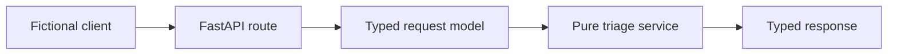

# Equipment Triage API

The Day 2 local project evolves the fictional Day 1 command-line utility into a tested API. It demonstrates a narrow, inspectable service boundary: FastAPI receives and validates a request; a pure Python service applies the deterministic rule; typed routes return the result, a small health signal, and the synthetic training rules.

## Run it

Requires Python 3.11 or later.

```bash
python -m venv .venv
source .venv/bin/activate # Windows PowerShell: .venv\Scripts\Activate.ps1
pip install -r requirements.txt
pytest
uvicorn app.main:app --reload
```

Open `http://127.0.0.1:8000/docs`. Everything in this project is fictional training data.

## Endpoints

- `GET /health` — confirms the local prototype is reachable; it is not a production readiness signal.
- `POST /triage` — validates a reading and returns one deterministic fictional priority.
- `GET /rules` — exposes the synthetic thresholds so the rule boundary is inspectable and testable.

## Architecture



## Exercises

1. Send a reading at exactly `90` temperature units. What does the service return, and which test proves it?
2. Submit an empty `equipment` field. Why is this rejected at the boundary instead of being handled in the triage rule?
3. Move the threshold rule into `app/main.py`. Notice which direct service tests no longer make sense; restore the separation.
4. Add one test for vibration-triggered urgency.
5. Make one focused Git commit that includes the route/service change, its direct tests, and any matching README update—but never `.env`, local output, or a real key.

## What to defend

- Why choose FastAPI for this small API rather than a script?
- Why keep request validation and business rules separate?
- What would change before exposing an equivalent service to more users?
