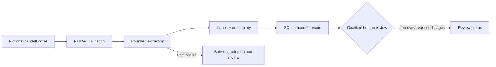

# Mission Operations Handoff Assistant

A fictional, training-only FastAPI capstone for the four-day Coding Developer intensive. It receives free-text shift handoffs, produces a structured draft, persists it in SQLite, and requires a human review status before any handoff is treated as approved.

It is not connected to operational systems, does not contain real data, and must not be treated as a deployment-ready or safety-critical system.

## What it demonstrates

- A typed `POST /handoffs` boundary with clear validation failures.
- A small request → service → provider → repository workflow.
- SQLite persistence, retrieval, and urgency/owner filtering.
- A model-provider boundary: optional OpenAI structured extraction may draft facts, but never approves work or performs an action.
- Deterministic training extraction and safe degraded mode when a provider is missing or unavailable.
- Explicit uncertainty and human review.
- Unit/integration behavior expressed as tests.

## Architecture



## Run locally

Requires Python 3.11+.

```bash
python -m venv .venv
source .venv/bin/activate
pip install -r requirements.txt
pytest
uvicorn app.main:app --reload
```

Open `http://127.0.0.1:8000/docs` for generated API documentation.

## Optional hosted-model practice

The default provider is deterministic so the project works without credentials. For a local, approved OpenAI experiment only, set environment variables outside source control:

```bash
export HANDOFF_PROVIDER=openai
export OPENAI_API_KEY='...'
export OPENAI_MODEL='approved-model-name'
```

Never place keys in code, commits, screenshots, handoff notes, or prompts. A missing or unavailable provider must yield `safe-degraded` mode and keep the record in `needs-human-review`.

## Deliberate failure exercises

1. Change the default review status to `approved`; prove the review-boundary test fails, then restore it.
2. Add a fictional prompt-injection line to a handoff and explain why it remains untrusted data, not a system instruction.
3. Make the provider unavailable and verify that the app stores uncertainty rather than inventing an owner.
4. Add a regression test for one urgency or owner-filter edge case.

## Case-study and defense evidence

Save the README, test output, API contract, architecture sketch, one safe degraded response, a sample SQLite record, and an AI-assistance disclosure. Be ready to explain:

- why a human review status is separate from model output;
- why SQLite is a prototype choice rather than a production assumption;
- what tests establish and what they do not;
- what data must remain out of an external provider;
- what you would change before broader use.
