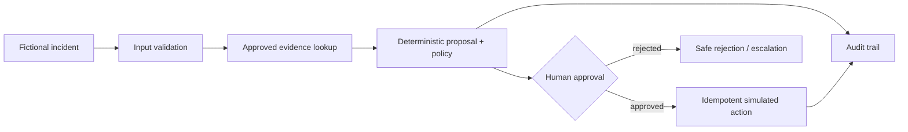

# Human-Approved Operations Triage Workflow

A fictional FastAPI prototype for demonstrating a constrained LLM-adjacent workflow. It prepares a structured recommendation, applies deterministic policy, waits for a qualified human approval, and records an auditable action. It never changes a real system.

## What it demonstrates

- Schema-validated incident intake and action proposals.
- Deterministic policy is the authority; generated text cannot grant permission.
- Consequential actions remain `awaiting_approval` until a qualified fictional reviewer approves them.
- Idempotency prevents duplicate execution after a client retry.
- Minimal audit events and a small SQLite-backed record support incident reconstruction.

## Architecture



## Run it

Requires Python 3.11+.

```bash
python -m venv .venv
source .venv/bin/activate
pip install -r requirements.txt
uvicorn app.main:app --reload
pytest
```

## Suggested workflow

1. Create a fictional `service-degraded` incident with an `Idempotency-Key` header.
2. Inspect the proposed action and policy boundary. It should not execute automatically.
3. Approve as `reviewer-cam`; then resend the same approval request and prove only one action was recorded.
4. Submit a critical or missing-evidence incident and explain why the workflow escalates instead of acting.

## Deliberate failure exercise

Temporarily change `can_execute` in `app/service.py` to permit unapproved actions. The test suite should fail. Restore the approval requirement and add a regression test if you change the policy.

## AI assistance disclosure

Document your own workflow mapping, policy choices, Pydantic schema review, test additions, failure investigation, and any AI-generated code you changed or rejected. A functioning endpoint is not proof of ownership without this record.

## Case-study evidence

Save a workflow map, action-permission matrix, API contract, one completed audit trace, test output, evaluation table, rollback decision, and a short stakeholder-ready implementation recommendation.
