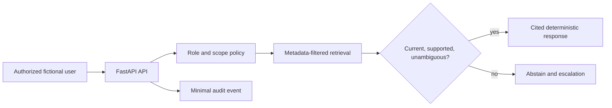

# Permission-Aware Operations Knowledge Assistant

An intentionally small, fictional FastAPI prototype for demonstrating an applied-AI operating boundary. It never uses real procedures, credentials, export-controlled material, or an external model by default.

## What it demonstrates

- Identity and authorization are enforced **before** retrieval.
- Retrieval returns only approved, current documents in the caller's scope.
- Answers cite their evidence or abstain; conflicting material is escalated.
- Every request produces a minimal audit event with a correlation ID.
- The default responder is deterministic. A live model is deliberately out of scope until a reviewed provider adapter is configured.

## Architecture



## Run it

Requires Python 3.11+.

```bash
python -m venv .venv
source .venv/bin/activate
pip install -r requirements.txt
uvicorn app.main:app --reload
pytest
```

Open `http://127.0.0.1:8000/docs` and use a fictional principal such as `eng-ada` or `ops-ben`.

## Exercises

1. Ask `eng-ada` for the current pump startup checklist. Explain why only one citation is returned.
2. Ask `ops-ben` for a propulsion procedure. Verify the request is denied before a document is retrieved.
3. Ask about a fictional procedure with conflicting revisions. Verify that the system abstains and records an escalation.
4. Add a new document and prove with a test that stale or unauthorized material cannot be cited.

## Deliberate failure exercise

In `app/service.py`, temporarily move the policy check below `repository.retrieve`. The authorization test should fail. Restore the safe order and explain why prompt instructions could never correct an authorization flaw at that layer.

## AI assistance disclosure

Use this template in the case study instead of hiding AI assistance:

- **I designed:** the data boundary, policy order, response contract, tests, and escalation behavior.
- **I implemented or reviewed:** API models, repository behavior, audit events, and automated tests.
- **AI assistance used:** list the tool and the specific non-trivial output it accelerated.
- **I independently verified:** name the tests, negative cases, and code paths you inspected or repaired.

## Case-study evidence

Save a workflow map, architecture diagram, source/evaluation table, a failing-test screenshot from the deliberate exercise, test output, and a short decision record naming the chosen pilot boundary and non-goals.
